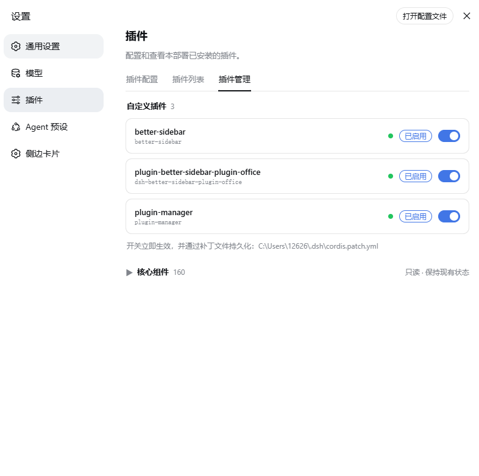

# dsh-plugin-manager

English | [中文](./README.md)

A plugin manager for the [DeepSeek Harness](https://github.com/deepseek-ai/deepseek-harness) (DSH) Web UI: adds a **Plugin Manager** tab to **Settings → Plugins** so you can inspect, enable, and disable installed plugins without touching any config file.

## Screenshot



## Features

- **Custom plugins** section (expanded by default): lists every user-installed plugin (any module outside the shipped `@deepseek-ai/*` scope counts as custom), each with a working toggle
  - Toggles take effect **immediately** — no restart: disabling unloads the plugin's host half and drops its browser half from the client module graph
  - Toggle state **persists**: written to a managed block in the user patch layer `~/.dsh/cordis.patch.yml`, so it survives DSH restarts
  - Plugins installed later show up here automatically — no extra configuration
- **Core components** section (collapsed by default): shows enable/Cordis mount status of every core component with the switch disabled — core components keep their current state and cannot be toggled (enforced in both the UI and the HTTP API)
- Each row shows the full module name, entry id, enabled state, and a live mount-phase indicator

## Installation

### Via the dsh CLI (recommended)

From this repository's directory (or use a git URL / npm package name):

```powershell
dsh plugin --profile web add .
```

The CLI installs the package into the profile and mounts it automatically.

### Manual installation

1. Copy this repository to `~/.dsh/profiles/web/node_modules/dsh-plugin-manager`
2. Append a mount row to `~/.dsh/profiles/web/cordis.patch.yml`:

   ```yaml
   - insert:
       - id: plugin-manager
         name: dsh-plugin-manager
   ```

3. No restart needed: the patch file is watched (HMR), so the host half mounts as soon as you save. **Refresh the browser page** and the tab appears under Settings → Plugins.

## How it works

- **Data source**: the host half reads the Cordis Loader entry tree directly — the same source as the shipped *Plugin list* tab. No second copy of the truth.
- **Toggle mechanism**: flipping a switch writes (or removes) an id-targeted patch in the user patch layer `~/.dsh/cordis.patch.yml`:

  ```yaml
  # >>> dsh-plugin-manager
  - id: better-sidebar
    disabled: true
  # <<< dsh-plugin-manager
  ```

  DSH watches this file and hot-applies it to the live composition tree, so toggles need no restart; the file itself is the persistence.
- **Host ↔ browser**: the host half registers two same-origin HTTP routes on the `webServer` service; the browser half simply `fetch`es them:

  | Route | Method | Description |
  | --- | --- | --- |
  | `/__plugin-manager__/list` | GET | All non-group entries (id, module name, enabled flag, fiber phase, custom flag) plus the patch file path |
  | `/__plugin-manager__/set-disabled` | POST | Body `{ "id": "<row id>", "disabled": true/false }`; core components are rejected with `403` |

## Caveats

- The manager lists itself under custom plugins. Disabling it disables the management UI too; to recover, edit `~/.dsh/cordis.patch.yml` and remove the `- id: plugin-manager` lines from the managed block (or empty the block).
- Uninstall: remove the mount row from `profiles/web/cordis.patch.yml` (hot-unloads immediately), then delete the package directory. If you ever disabled a plugin via the toggle, clean up its leftover entry in the managed block after uninstalling it.
- A manually copied folder inside `node_modules` is not tracked by pnpm; if a later `pnpm install` prunes it, just reinstall as above.

## Development

Plain JavaScript, zero dependencies, zero build step:

```
lib/host.js     Host half (ESM, default-exports a Cordis plugin object)
lib/client.js   Browser half (window.__ModuleLoader__ format)
```

Key lessons baked into the code:

- The host half declares `loader` and `webServer` as hard `inject` dependencies. DSH mounts entries concurrently at boot, so a lazy `ctx.get('webServer')` races startup and silently skips route registration.
- Patch targets are **row ids** from the composed config data (`entry.options.id`), not runtime entry ids (the `include:xxx` form).

## License

[MIT](./LICENSE)
